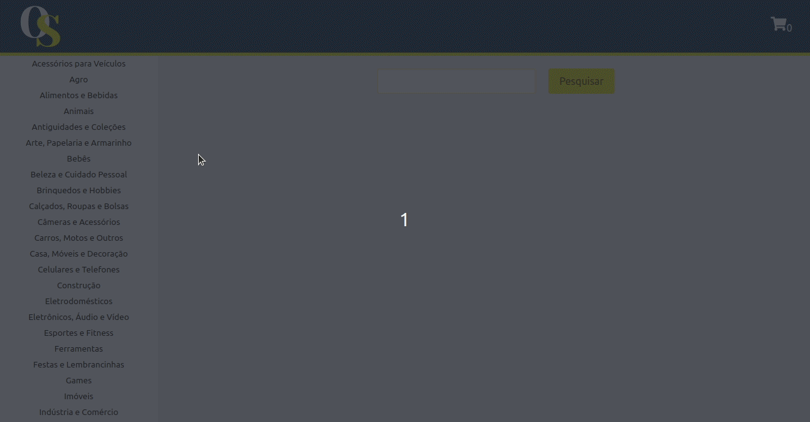

# Boas-vindas ao repositório do projeto Frontend Online Store!

Projeto desenvolvido em grupo no curso da Trybe ao final do bloco 13* do Módulo 2 - Desenvolvimento Front-end.  
<strong>Bloco 13: Metodologias Ágeis</strong> 
 13.1 - Metodologias Ágeis 
 13.2 - Projeto - Frontend Online Store  

No projeto <strong>Frontend Online Store</strong> foi desenvolvida uma aplicação em react simulando um site de vendas de produtos. Na página inicial é possível procurar produtos através do nome ou por categorias, ao clicar no produto desejado a aplicação é redirecionada para uma página com detalhes do mesmo. No carrinho de compra é possível remover ou alterar a quantidade do produto, conforme a disponibilidade em estoque. Por fim é renderizado uma página com o resumo da compra e um formulário para colocar informações do comprador assim como a forma de pagamento. 
A estilização do projeto foi feita individualmente utilizado o Sass, react-icon e o framework Bulma.

Veja o resultado: https://nataliafranceschi.github.io/13-Frontend-Online-Store/

